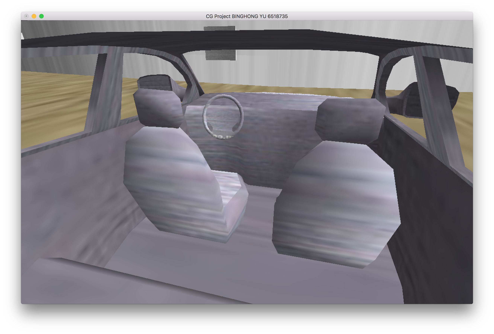

# Simple-3D-Airport


## Project Description

My project is to build a 3D model of an island airport using the OPENGL framework. In this 3D scene, in addition to the basic static airport scene, the user can control the takeoff and landing of one aircraft through the keyboard. Many different viewing angles of the camera position are supported.


## Demo

https://www.bilibili.com/video/av85357675/


### Operation instruction

|    u    |    aircraft move forward    |
| :-----: | :-------------------------: |
|  **j**  |   **aircraft move back**    |
|  **h**  |   **aircraft turn left**    |
|  **k**  |   **aircraft turn right**   |
|  **c**  |    **aircraft move up**     |
|  **v**  |   **aircraft move down**    |
|  **b**  | **change background color** |
|  **n**  |  **change billboard info**  |
|  **o**  |        **camera up**        |
|  **p**  |       **camera down**       |
| **esc** |          **exit**           |
| **W/w** |     **camera forward**      |
| **S/s** |       **camera back**       |
| **A/a** |       **camera left**       |
| **D/d** |      **camera right**       |


### Environment

```
System: Mac OS X 10_13_1
cmake version: 3.10.2
g++ version: 4.2.1
CLion version: 2017.2.3
OpenGL version: 2.1 INTEL-10.28.29
GLUT version: 1.3 MacOSX
```


### Framework

Although the framework provided in Lab is used, in order to achieve more functional effects, many classes are actually rewritten or integrated in this project application.


## Model 

### Fully Independent Model

This type of model is built by the basic OPENGL library API through certain operations, 100% code is owned.

In order to optimize the project structure, in addition to relying on the framework provided in lab, the necessary basic elements are built for different base models, and a `DrawObject` class is optimized under the framework of `myFramework`. See **Appendix** about the project structure and code details.

#### Aircraft


```
Aircraft model = 
BodyCylinder(Cylinder) + RightWing(Wing) + LeftWing(Wing) + Head(TruncatedConeWithSkipAngle + TruncatedCone) + Tail(TruncatedCone) + TopTailWing(Wing) + RightTailWing(Wing) + DrawLeftTailWing(Wing)
```

See **Appendix** about the code details of the  aircraft model.

In addition to the basic model rendering in the Aircraft class, cab camera position and view direction data and motion control are preserved for the aircraft being controlled, as will be detailed later.


#### AirportFloor


The material floors on both sides of the runway is made up of two `AirportFloor `  classes with different textures, which is essentially a small box with a narrow height.

See **Appendix** about the code details of the  AirportFloor model.


#### Runway


Although the runway class tried to implement it through import, but because the texture effect is not good, I choose to draw the model myself. The code that imports the model is retained in the code, but it is actually not visible in the program because the new model is on top of it.

See **Appendix** about the code details of the  Runway model.


#### Billboard - show info part


Billboard is an externally imported model, but in order to switch the displayed content automatically or manually, the external display part (similar to the screen) is not imported but self-build.

See **Appendix** about the code details of the  Billboard model.


### Imported Model

In order to be able to import the obj-formatted model into the project, the `obj loader` in the lab was used and optimized to make it possible to load more generic models and read  `mtl` file info.

- Fixed Problem
  - Read consecutive spaces.
  - Allow 'f' data read four parameters.
  - Skip "#" comments
  - Load normal points info
  - Load texture points info
  - Draw 'f' data with four parameters.
  - Load surface material info
  - Optimize storage data structures to increase rendering speed 

#### Airport

See **Appendix** about the code details of the  Airport model.

#### Tower


See **Appendix** about the code details of the  Tower model.

#### Car




See **Appendix** about the code details of the Car model.

#### Billboard

See **Appendix** about the code details of the Billboard model.


## Transformation

### Inside Model

Many complex self-built models, such as aircraft interiors, are composed of many basic elements by scaling, translating, and rotating.

```
Aircraft model = 
BodyCylinder(Cylinder) + RightWing(Wing) + LeftWing(Wing) + Head(TruncatedConeWithSkipAngle + TruncatedCone) + Tail(TruncatedCone) + TopTailWing(Wing) + RightTailWing(Wing) + DrawLeftTailWing(Wing)
```

See **Appendix** about the code details of the  aircraft model.

### In Scene

In the scene, the placement of different models, including self-built and imported models, is done by scaling, translating and rotating. 

For example, the aircraft model is perfectly integrated with the boarding gate of the airport model.


See **Appendix** about the code details of the Scene.

### Key Controls

Controlling moving objects through the keyboard is also essentially transformation. 

### Camera

The position of the cabin  camera and the view direction calculation are also used.

```cpp
void Aircraft::GetDriverCamera(float &x, float &y, float &z)
{

    x = driverCamera[0]*scale[0];
    y = driverCamera[1]*scale[1];
    z = driverCamera[2]*scale[2];

    Rotate(x, y, z);

    x = x +pos[0];
    y = y +pos[1];
    z = z +pos[2];
}

void Aircraft::GetDriverViewDir(float &x, float &y, float &z)
{
    x = driverViewDir[0];
    y = driverViewDir[1];
    z = driverViewDir[2];

    Rotate(x, y, z);
}

void Aircraft::Rotate(float &x, float &y, float &z)
{
    float y1 = cos(rotation[0] / (float)360 * (float)2 * M_PI)* y
               + sin(rotation[0] / (float)360 * (float)2 * M_PI) * z;

    float z1 = - sin(rotation[0] / (float)360 * (float)2 * M_PI)* y
               + cos(rotation[0] / (float)360 * (float)2 * M_PI) * z;
    float x1 = x;

    float x2 = cos(rotation[1] / (float)360 * (float)2 * M_PI)* x1
               + sin(rotation[1] / (float)360 * (float)2 * M_PI) * z1;

    float z2 = - sin(rotation[1] / (float)360 * (float)2 * M_PI)* x1
               + cos(rotation[1] / (float)360 * (float)2 * M_PI) * z1;
    float y2 = y1;

    float x3 = cos(rotation[2] / (float)360 * (float)2 * M_PI)* x2
               - sin(rotation[2] / (float)360 * (float)2 * M_PI) * y2;

    float y3 = sin(rotation[2] / (float)360 * (float)2 * M_PI)* x2
               + cos(rotation[2] / (float)360 * (float)2 * M_PI) * y2;
    float z3 = z2;

    x = x3; y = y3; z = z3;

}
```


## Viewpoints

The Scene and Camera classes have been rewritten in this project to have the ability to change the perspective and keyboard control.

```cpp
void ProjectScene::Update(const double& deltaTime)
{
    Animation* animated_obj;
    // Update camera/view
    camera.Update(deltaTime);
    // Iterate through objects to update animations

    if (isControl)
    {
        float eye[3];
        cotrolledAircraft->GetDriverCamera(eye[0], eye[1], eye[2]);
        camera.SetEyePosition(eye[0], eye[1], eye[2]);
        float dir[3];
        cotrolledAircraft->GetDriverViewDir(dir[0], dir[1], dir[2]);
        camera.SetViewDirection(dir[0] , dir[1], dir[2]);
    }

    if (isBlue)
    {
        glClearColor(0.527f, 0.77f, 0.886f, 1.0f);
    }
    else
    {
        glClearColor(0.0f, 0.0f, 0.0f, 1.0f);
    }

    for (DisplayableObject* obj : objects)
    {
        animated_obj = dynamic_cast<Animation*>(obj); // Cast to animation
        if (animated_obj != NULL) // If cast successful
            animated_obj->Update(deltaTime); // Call update sequence for obj
    }
}
```

```cpp
void  ProjectScene::HandleKey(unsigned char key, int state, int x, int y)
{
    // Handle Keyboard input (ASCII) and pass to objects.
    // State is 1 for key press, 0 for key release

    if (key == 27 && state) // Check for escape key pressed
    {
        exit(0); // EXIT ON ESCAPE PRESS
    }

    if (key == 'b' && state)
        isBlue = !isBlue;


    if (key == '6' && state)
    {
        float eye[3];
        camera.GetEyePosition(eye[0] , eye[1], eye[2]);
        cout << "(" << eye[0] << ", " << eye[1] << ", " << eye[2] << ")"<< endl;
    }

    if (key == '7' && state)
    {
        float dir[3];
        camera.GetViewDirection(dir[0] , dir[1], dir[2]);
        cout << "{" << dir[0] << ", " << dir[1] << ", " << dir[2] << "}"<< endl;
    }

    if (key == '1' && state)
    {
        float eye[3] = {855.984, 210, 82.0659};
        camera.SetEyePosition(eye[0], eye[1], eye[2]);
        float dir[3] = {0.77527, 0.199578, -0.59927f};
        camera.SetViewDirection(dir[0] , dir[1], dir[2]);

        isControl = false;
    }

    if (key == '2' && state)
    {
        float eye[3] = {-31.2647f, 268, 753.57};
        camera.SetEyePosition(eye[0], eye[1], eye[2]);
        float dir[3] = {0.271686, -0.205592f, -0.940169f};
        camera.SetViewDirection(dir[0] , dir[1], dir[2]);

        isControl = false;
    }

    if (key == '3' && state)
    {
        float eye[3] = {919.903, 552, 592.121};
        camera.SetEyePosition(eye[0], eye[1], eye[2]);
        float dir[3] = {-0.452299f, -0.496826f, -0.740669f};
        camera.SetViewDirection(dir[0], dir[1], dir[2]);

        isControl = false;
    }

    if (key == '4' && state)
    {
        float eye[3] = {600.12, 40, 1521.52};
        camera.SetEyePosition(eye[0], eye[1], eye[2]);
        float dir[3] = {-0.0519261, -0.111391, -0.992419};
        camera.SetViewDirection(dir[0] , dir[1], dir[2]);

        isControl = false;
    }

    if (key == '5' && state)
    {
        float eye[3] = {141.098, 21, 665.282};
        camera.SetEyePosition(eye[0], eye[1], eye[2]);
        float dir[3] = {-0.702746, -0.244084, -0.66826};
        camera.SetViewDirection(dir[0] , dir[1], dir[2]);

        isControl = false;
    }

    if (key == '8' && state)
    {
        cotrolledAircraft->size(13.0f);
        cotrolledAircraft->position(130.0f, 20.0f, 10.0f);
        cotrolledAircraft->orientation(0.0f, 210.0f, 0.0f);
        cotrolledAircraft->Reset();
    }

    if (key == '9' && state)
    {
        float eye[3];
        cotrolledAircraft->GetDriverCamera(eye[0], eye[1], eye[2]);
        camera.SetEyePosition(eye[0], eye[1], eye[2]);
        float dir[3];
        cotrolledAircraft->GetDriverViewDir(dir[0], dir[1], dir[2]);
        camera.SetViewDirection(dir[0] , dir[1], dir[2]);

        isControl = true;
    }

    Input* input_obj;
    camera.HandleKey(key, state, x, y);
    for (DisplayableObject* obj : objects)
    {
        input_obj = dynamic_cast<Input*>(obj);
        if (input_obj != NULL)
            input_obj->HandleKey(key, state, x, y);
    }

}
```


### Default Points

At the beginning of the program, you will enter an initial perspective for the bulletin board.

It can also be changed to other initial camera positions immediately by pressing the button.


### Moving perspective

It can also be locked in the perspective of the controlled aircraft. It is worth mentioning that, by calculation, the angle of view has always been bound to the aircraft cockpit even if the aircraft is moving.


## Animations

### Sky

You can change the color of the sky by pressing the button.

```cpp
void ProjectScene::Update(const double& deltaTime)
{
    Animation* animated_obj;
    // Update camera/view
    camera.Update(deltaTime);
    // Iterate through objects to update animations

    if (isControl)
    {
        float eye[3];
        cotrolledAircraft->GetDriverCamera(eye[0], eye[1], eye[2]);
        camera.SetEyePosition(eye[0], eye[1], eye[2]);
        float dir[3];
        cotrolledAircraft->GetDriverViewDir(dir[0], dir[1], dir[2]);
        camera.SetViewDirection(dir[0] , dir[1], dir[2]);
    }

    if (isBlue)
    {
        glClearColor(0.527f, 0.77f, 0.886f, 1.0f);
    }
    else
    {
        glClearColor(0.0f, 0.0f, 0.0f, 1.0f);
    }

    for (DisplayableObject* obj : objects)
    {
        animated_obj = dynamic_cast<Animation*>(obj); // Cast to animation
        if (animated_obj != NULL) // If cast successful
            animated_obj->Update(deltaTime); // Call update sequence for obj
    }
}
```


### Billboard

The contents of the board are updated every minute or manually by pressing the button.

```cpp
void Billboard::Update(const double &deltaTime)
{
    time += deltaTime;

    if (!isNext)
    {
        if ( (int )time / 60 != tmp)
        {
            return;
        }
        else
        {
            tmp = tmp + 1;
        }

    }
    else
    {
        isNext = false;
    }

    textLabel = (textLabel + 1) % 2;
}
```

```cpp
void Billboard::Display()
{
    glPushMatrix();
    glTranslatef(pos[0], pos[1], pos[2]);
    glScalef(scale[0], scale[1], scale[2]);
    glRotatef(rotation[2], 0.0f, 0.0f, 1.0f);
    glRotatef(rotation[1], 0.0f, 1.0f, 0.0f);
    glRotatef(rotation[0], 1.0f, 0.0f, 0.0f);

    glPushAttrib(GL_ALL_ATTRIB_BITS);

    glEnable(GL_TEXTURE_2D);
    glEnable(GL_COLOR_MATERIAL);
    glBindTexture(GL_TEXTURE_2D, texID);

    //glColor3f(1.0f, 1.0f, 1.0f);
    objLoader->Draw();

    glDisable(GL_COLOR_MATERIAL);
    glBindTexture(GL_TEXTURE_2D, NULL);
    glDisable(GL_TEXTURE_2D);

    glPopAttrib();
    glPopMatrix();

    glEnable(GL_TEXTURE_2D);
    glBindTexture(GL_TEXTURE_2D, texIDbillboard[textLabel] );

    glPushMatrix();
    glTranslatef(pos[0] - 60.0f, pos[1] + 265.0f, pos[2]+2.0f);
    glScalef(scale[0], scale[1], scale[2]);
    //glRotatef(rotation[2], 0.0f, 0.0f, 1.0f);
    glRotatef(-66.0f, 0.0f, 1.0f, 0.0f);
    glRotatef(90.0f, 1.0f, 0.0f, 0.0f);

    glScalef(180.0f, 1.0f, 48.0f);

    DrawCube();

    glPopMatrix();

    glBindTexture(GL_TEXTURE_2D, NULL);
    glDisable(GL_TEXTURE_2D);
}
```


### Aircraft

The airplane can be advanced by the button, backward, left turn, right turn, lift off, and descend.

```cpp
void Aircraft::Update(const double &deltaTime)
{
    if (isControlled)
    {
        float v = 1.0f;
        float v_r = 0.5f;
        if (uKey)
        {
            float dir[3];
            GetDriverViewDir(dir[0], dir[1], dir[2]);
            pos[0] += dir[0] * v;
            pos[1] += dir[1] * v;
            pos[2] += dir[2] * v;
        }

        if (jKey)
        {
            float dir[3];
            GetDriverViewDir(dir[0], dir[1], dir[2]);
            pos[0] -= dir[0] * v;
            pos[1] -= dir[1] * v;
            pos[2] -= dir[2] * v;
        }

        if (hKey)
        {
            rotation[1] += 1.0f * v_r;
        }

        if (kKey)
        {
            rotation[1] -= 1.0f * v_r;
        }

        if (zKey)
        {
            rotation[0] += 1.0f * v_r;
        }

        if (xKey)
        {
            rotation[0] -= 1.0f * v_r;
        }

        if (cKey)
        {
            pos[1] += 1.0f * v;
        }

        if (vKey)
        {
            if (pos[1] - 1.0f * v >= 20.0)
                pos[1] -= 1.0f * v;
        }
    }
}
```


### Water

The water around the island will shake with time.


## Texturing

The following models were Texturing

- Airport
- AirportFloor
- Billboard
- Car
- Runway
- Tower
- Aircraft cockpit driving panel
- Billboard info
- Water


For the imported model, the texture is read using the corrected texture coordinates due to the optimized ObjLoader.

```cpp
void ObjLoader::Draw(){

    //GLfloat morphR = morphRadis(vSets);
    //cout << morphR << endl;

    //const GLint animationEndTime = 4000;

    //GLint currentFrameTime = glutGet(GLUT_ELAPSED_TIME);

    //animationLastingTime += currentFrameTime - lastFrameTime;

    /*GLfloat step = (GLfloat)animationLastingTime / animationEndTime;

    if (step > 1.0f) {
        step = 1.0f;
        glutSolidSphere(morphR, 40, 50);
    }*/

//    glBegin(GL_TRIANGLES);

    //glDisable(GL_COLOR_MATERIAL);

//    glEnable(GL_TEXTURE_2D);
//    glEnable(GL_COLOR_MATERIAL);
//    glBindTexture(GL_TEXTURE_2D, texID);

    for (int i = 0; i < fSets.size(); i++) {

        if(fSets[i][0].size() == 3)
        {
            glBegin(GL_TRIANGLES);
        }
        else
        {
            glBegin(GL_POLYGON);
        }

        //three vertex represrnt a surface
        GLfloat SV1[3];
        GLfloat	SV2[3];
        GLfloat SV3[3];
        GLfloat SV4[3];

        GLfloat VN1[3];
        GLfloat VN2[3];
        GLfloat VN3[3];
        GLfloat VN4[3];

        GLfloat VT1[2];
        GLfloat VT2[2];
        GLfloat VT3[2];
        GLfloat VT4[2];

        GLint firstVertexIndex = (fSets[i][0])[0];
        GLint secondVertexIndex = (fSets[i][0])[1];
        GLint thirdVertexIndex = (fSets[i][0])[2];
        GLint fourthVertexIndex;

        GLint firstNVertexIndex = (fSets[i][2])[0];
        GLint secondNVertexIndex = (fSets[i][2])[1];
        GLint thirdNVertexIndex = (fSets[i][2])[2];
        GLint fourthNVertexIndex;

        GLint firstTVertexIndex = (fSets[i][1])[0];
        GLint secondTVertexIndex = (fSets[i][1])[1];
        GLint thirdTVertexIndex = (fSets[i][1])[2];
        GLint fourthTVertexIndex;

        SV1[0] = (vSets[firstVertexIndex])[0];
        SV1[1] = (vSets[firstVertexIndex])[1];
        SV1[2] = (vSets[firstVertexIndex])[2];

        SV2[0] = (vSets[secondVertexIndex])[0];
        SV2[1] = (vSets[secondVertexIndex])[1];
        SV2[2] = (vSets[secondVertexIndex])[2];

        SV3[0] = (vSets[thirdVertexIndex])[0];
        SV3[1] = (vSets[thirdVertexIndex])[1];
        SV3[2] = (vSets[thirdVertexIndex])[2];

        VN1[0] = (vnSets[firstNVertexIndex])[0];
        VN1[1] = (vnSets[firstNVertexIndex])[1];
        VN1[2] = (vnSets[firstNVertexIndex])[2];

        VN2[0] = (vnSets[secondNVertexIndex])[0];
        VN2[1] = (vnSets[secondNVertexIndex])[1];
        VN2[2] = (vnSets[secondNVertexIndex])[2];

        VN3[0] = (vnSets[thirdNVertexIndex])[0];
        VN3[1] = (vnSets[thirdNVertexIndex])[1];
        VN3[2] = (vnSets[thirdNVertexIndex])[2];

        VT1[0] = (vtSets[firstTVertexIndex])[0];
        VT1[1] = (vtSets[firstTVertexIndex])[1];

        VT2[0] = (vtSets[secondTVertexIndex])[0];
        VT2[1] = (vtSets[secondTVertexIndex])[1];

        VT3[0] = (vtSets[thirdTVertexIndex])[0];
        VT3[1] = (vtSets[thirdTVertexIndex])[1];

        if ((fSets[i][0]).size() == 4)
        {
            fourthVertexIndex = (fSets[i][0])[3];
            fourthNVertexIndex = (fSets[i][2])[3];
            fourthTVertexIndex = (fSets[i][1])[3];

            SV4[0] = (vSets[fourthVertexIndex])[0];
            SV4[1] = (vSets[fourthVertexIndex])[1];
            SV4[2] = (vSets[fourthVertexIndex])[2];

            VN4[0] = (vnSets[fourthNVertexIndex])[0];
            VN4[1] = (vnSets[fourthNVertexIndex])[1];
            VN4[2] = (vnSets[fourthNVertexIndex])[2];

            VT4[0] = (vtSets[fourthTVertexIndex])[0];
            VT4[1] = (vtSets[fourthTVertexIndex])[1];
        }

        if (mtlMap.size() != 0)
        {
            map<string, vector<vector<GLfloat>>>::iterator j = mtlMap.find(fSetsMtlLabel[i]);

            if (j != mtlMap.end())
            {
                vector<vector<GLfloat>> mtl = j->second;

                float ka[4] = {mtl[0][0], mtl[0][1], mtl[0][2], 1};
                float kd[4] = {mtl[1][0], mtl[1][1], mtl[1][2], 1};
                float ks[4] = {mtl[2][0], mtl[2][1], mtl[2][2], 1};

                glMaterialfv(GL_FRONT, GL_AMBIENT, ka);
                glMaterialfv(GL_FRONT, GL_DIFFUSE, kd);
                glMaterialfv(GL_FRONT, GL_SPECULAR, ks);
            }
        }

        glColor3f(1.0f, 1.0f, 1.0f);

        glNormal3f(VN1[0], VN1[1], VN1[2]);
        glTexCoord2f(VT1[0], VT1[1]);
        glVertex3f(SV1[0], SV1[1], SV1[2]);
        glNormal3f(VN2[0], VN2[1], VN2[2]);
        glTexCoord2f(VT2[0], VT2[1]);
        glVertex3f(SV2[0], SV2[1], SV2[2]);
        glNormal3f(VN3[0], VN3[1], VN3[2]);
        glTexCoord2f(VT3[0], VT3[1]);
        glVertex3f(SV3[0], SV3[1], SV3[2]);

        if ((fSets[i][0]).size() == 4)
        {
            glNormal3f(VN4[0], VN4[1], VN4[2]);
            glTexCoord2f(VT4[0], VT4[1]);
            glVertex3f(SV4[0], SV4[1], SV4[2]);
        }

        glEnd();

    }

//    glDisable(GL_COLOR_MATERIAL);
//    glBindTexture(GL_TEXTURE_2D, NULL);
//    glDisable(GL_TEXTURE_2D);

//    glEnd();

    //lastFrameTime = currentFrameTime;
}

```


For the model that is self-built, make simple texturing.

```cpp
void DrawObject::DrawCube()
{
    glPushMatrix();
    glBegin(GL_POLYGON);
    glNormal3d(0.0f, 0.0f, 1.0f);
    glColor3f( 1.0f, 0.0f, 0.0f ); // red
    glVertex3f( 1.0f, -1.0f, 1.0f );
    glColor3f( 0.0f, 1.0f, 0.0f ); // green
    glVertex3f( 1.0f, 1.0f, 1.0f );
    glColor3f( 0.0f, 0.0f, 1.0f ); // blue
    glVertex3f( -1.0f, 1.0f, 1.0f );
    glColor3f( 1.0f, 0.0f, 1.0f );
    glVertex3f( -1.0f, -1.0f, 1.0f);// purple
    glEnd();
    // White ¨C BACK
    glBegin(GL_POLYGON);
    glNormal3d(0.0f, 0.0f, -1.0f);
    glColor3f(   1.0f,  1.0f, 1.0f );
    glVertex3f(  1.0f, -1.0f, -1.0f );
    glVertex3f(  1.0f, 1.0f, -1.0f );
    glVertex3f( -1.0f, 1.0f, -1.0f );
    glVertex3f( -1.0f, -1.0f, -1.0f );
    glEnd();
    // Blue ¨C TOP

    glBegin(GL_POLYGON);
    glNormal3d(0.0f, 1.0f, 0.0f);
    glColor3f( 0.0f, 0.0f, 1.0f );
    glTexCoord2f(1.0f, 0.0f);
    glVertex3f( 1.0f, 1.0f, 1.0f );
    glTexCoord2f(1.0f, 1.0f);
    glVertex3f( 1.0f, 1.0f, -1.0f );
    glTexCoord2f(0.0f, 1.0f);
    glVertex3f( -1.0f, 1.0f, -1.0f );
    glTexCoord2f(0.0f, 0.0f);
    glVertex3f( -1.0f, 1.0f, 1.0f );
    glEnd();

    // Red ¨C BOTTOM
    glBegin(GL_POLYGON);
    glNormal3d(0.0f, -1.0f, 0.0f);
    glColor3f( 1.0f,  0.0f,  0.0f );
    glVertex3f( -1.0f, -1.0f, 1.0f );
    glVertex3f( -1.0f, -1.0f, -1.0f );
    glVertex3f( 1.0f, -1.0f, -1.0f );
    glVertex3f( 1.0f, -1.0f, 1.0f );
    glEnd();
    // Green ¨C LEFT
    glBegin(GL_POLYGON);
    glNormal3d(-1.0f, 0.0f, 0.0f);
    glColor3f(   0.0f,  1.0f,  0.0f );
    glVertex3f( -1.0f, -1.0f, 1.0f );
    glVertex3f( -1.0f, 1.0f, 1.0f );
    glVertex3f( -1.0f, 1.0f, -1.0f );
    glVertex3f( -1.0f, -1.0f, -1.0f );
    glEnd();
    // Purple ¨C RIGH
    glBegin(GL_POLYGON);
    glNormal3d(1.0f, 0.0f, 0.0f);
    glColor3f(  1.0f,  0.0f,  1.0f );
    glVertex3f( 1.0f, -1.0f, -1.0f );
    glVertex3f( 1.0f, 1.0f, -1.0f );
    glVertex3f( 1.0f, 1.0f, 1.0f );
    glVertex3f( 1.0f, -1.0f, 1.0f );
    glEnd();

    glPopMatrix();
}
```


## Lighting

Similarly, use the properties in the mtl file read by ObjLoader to set the light info.

```cpp
if (parameters.size() != 0)
        {
            string resourceDirectory = "../src/data/";

            if (parameters[0] == "mtllib")
            {
                resourceDirectory = resourceDirectory.append(parameters[1]);
                resourceDirectory.pop_back();
                // cout << "find mtl file: " << resourceDirectory << endl;

                fstream fm;
                string lineM;

                fm.open(resourceDirectory, ios::in);

                if (!fm.is_open())
                {
                    cout << "Something Went Wrong When Opening .mtl files" << endl;
                }
                else
                {
                    vector<GLfloat> tmpKa;
                    vector<GLfloat> tmpKd;
                    vector<GLfloat> tmpKs;

                    string tmpGroupName = "";

                    while (!fm.eof())
                    {
                        getline(fm, lineM);

                        vector<string>parametersM;
                        string tailMarkM = " ";
                        string ansM = "";
                        lineM = lineM.append(tailMarkM);

                        for (int i = 0; i < lineM.length(); i++)
                        {
                            char ch = lineM[i];
                            if (ch != ' ' && ch != '\t')
                            {
                                ansM+=ch;
                            }
                            else
                            {
                                if (ansM != "")
                                {
                                    parametersM.push_back(ansM);
                                }
                                ansM = "";
                            }
                        }

                        if (parametersM.size() != 0)
                        {
                            if (parametersM[0] != "#")
                            {
                                if (parametersM[0] == "newmtl")
                                {
                                    // cout << "find new mtl name: "<< parametersM[1] << endl;

                                    tmpGroupName = parametersM[1];
                                }

                                if (parametersM[0] == "Ka")
                                {
                                    tmpKa.clear();
                                    tmpKa.push_back(atof(parametersM[1].c_str()));
                                    tmpKa.push_back(atof(parametersM[2].c_str()));
                                    tmpKa.push_back(atof(parametersM[3].c_str()));
                                }

                                if (parametersM[0] == "Kd")
                                {
                                    tmpKd.clear();
                                    tmpKd.push_back(atof(parametersM[1].c_str()));
                                    tmpKd.push_back(atof(parametersM[2].c_str()));
                                    tmpKd.push_back(atof(parametersM[3].c_str()));
                                }

                                if (parametersM[0] == "Ks")
                                {
                                    tmpKs.clear();
                                    tmpKs.push_back(atof(parametersM[1].c_str()));
                                    tmpKs.push_back(atof(parametersM[2].c_str()));
                                    tmpKs.push_back(atof(parametersM[3].c_str()));

                                    vector<vector<GLfloat>> newMtl;
                                    newMtl.push_back(tmpKa);
                                    newMtl.push_back(tmpKd);
                                    newMtl.push_back(tmpKs);

                                    mtlMap.insert(pair <string, vector<vector<GLfloat>>> (tmpGroupName, newMtl));
                                    tmpGroupName = "";
                                }
                            }
                        }
                    }
                }

                fm.close();

            }
```

```cpp
if (mtlMap.size() != 0)
        {
            map<string, vector<vector<GLfloat>>>::iterator j = mtlMap.find(fSetsMtlLabel[i]);

            if (j != mtlMap.end())
            {
                vector<vector<GLfloat>> mtl = j->second;

                float ka[4] = {mtl[0][0], mtl[0][1], mtl[0][2], 1};
                float kd[4] = {mtl[1][0], mtl[1][1], mtl[1][2], 1};
                float ks[4] = {mtl[2][0], mtl[2][1], mtl[2][2], 1};

                glMaterialfv(GL_FRONT, GL_AMBIENT, ka);
                glMaterialfv(GL_FRONT, GL_DIFFUSE, kd);
                glMaterialfv(GL_FRONT, GL_SPECULAR, ks);
            }
        }
```


Of course, there is a default light source setting in the frame itself.

```cpp
void Engine::InitFunc()
{
	// Default background colour
	glClearColor(static_cast<GLclampf>(0.0f), static_cast<GLclampf>(0.0f), static_cast<GLclampf>(0.0f), static_cast<GLclampf>(1.0f));

	// Enable depth testing
	glEnable(GL_DEPTH_TEST);
	glDepthFunc(GL_LEQUAL);

	// Enable backface culling
	glEnable(GL_CULL_FACE);

	// Enable transparency blending
	glEnable(GL_BLEND);
	glBlendFunc(GL_SRC_ALPHA, GL_ONE_MINUS_SRC_ALPHA);

	// Enable 2-D texturing
	glEnable(GL_TEXTURE_2D);

	// Enable blending colour information with texture information
	glEnable(GL_COLOR_MATERIAL);

	// Turn off 2 sided lighting
	glLightModeli(GL_LIGHT_MODEL_TWO_SIDE, GL_FALSE);

	// set the ambient light model
	GLfloat global_ambient[] = {0.2f, 0.2f, 0.2f, 1.0f};
	glLightModelfv(GL_LIGHT_MODEL_AMBIENT, global_ambient);

	// enable directional light lighting
	// (x, y, z, 0.0) -> directional lighting
	// (x, y, z, 1.0) -> positional lighting
	glEnable(GL_LIGHTING);
	GLfloat ambience[] = {0.2f, 0.2f, 0.2f, 1.0f};
	GLfloat diffuse[] = {0.8f, 0.8f, 0.8f, 1.0f};
	GLfloat specular[] = {1.0f, 1.0f, 1.0f, 1.0f};
	GLfloat position[] = {1.0f, 1.0f, 1.0f, 0.0f};
	glLightfv(GL_LIGHT0, GL_AMBIENT, ambience);
	glLightfv(GL_LIGHT0, GL_DIFFUSE, diffuse);
	glLightfv(GL_LIGHT0, GL_SPECULAR, specular);
	glLightfv(GL_LIGHT0, GL_POSITION, position);
	glEnable(GL_LIGHT0);

	// Enable smooth shading from lighting
	glShadeModel(GL_SMOOTH);

	// Enable automatic normalisation of normal vectors
	glEnable(GL_NORMALIZE);

	current->Initialise();
	time = 0;

}
```


## Appendix

### Code Structure

```
.
├── CMakeLists.txt
├── Framework
│   ├── Engine
│   │   ├── Engine.cpp
│   │   ├── Engine.h
│   │   ├── Scene.cpp
│   │   └── Scene.h
│   ├── Interface
│   │   ├── Animation.h
│   │   ├── DisplayableObject.h
│   │   └── Input.h
│   └── Utility
│       ├── Camera.cpp
│       ├── Camera.h
│       ├── Texture.cpp
│       ├── Texture.h
│       └── VectorMath.h
├── cmake-build-debug
│   ├── CMakeCache.txt
│   ├── CMakeFiles
│   │   ├── 3.8.2
│   │   │   ├── CMakeCCompiler.cmake
│   │   │   ├── CMakeCXXCompiler.cmake
│   │   │   ├── CMakeDetermineCompilerABI_C.bin
│   │   │   ├── CMakeDetermineCompilerABI_CXX.bin
│   │   │   ├── CMakeSystem.cmake
│   │   │   ├── CompilerIdC
│   │   │   │   ├── CMakeCCompilerId.c
│   │   │   │   ├── a.out
│   │   │   │   └── tmp
│   │   │   └── CompilerIdCXX
│   │   │       ├── CMakeCXXCompilerId.cpp
│   │   │       ├── a.out
│   │   │       └── tmp
│   │   ├── CMakeDirectoryInformation.cmake
│   │   ├── CMakeOutput.log
│   │   ├── CMakeTmp
│   │   ├── Makefile.cmake
│   │   ├── Makefile2
│   │   ├── TargetDirectories.txt
│   │   ├── clion-environment.txt
│   │   ├── clion-log.txt
│   │   ├── cmake.check_cache
│   │   ├── feature_tests.bin
│   │   ├── feature_tests.c
│   │   ├── feature_tests.cxx
│   │   ├── progress.marks
│   │   └── project.dir
│   │       ├── CXX.includecache
│   │       ├── DependInfo.cmake
│   │       ├── Framework
│   │       │   ├── Engine
│   │       │   │   ├── Engine.cpp.o
│   │       │   │   └── Scene.cpp.o
│   │       │   ├── Light
│   │       │   └── Utility
│   │       │       ├── Camera.cpp.o
│   │       │       └── Texture.cpp.o
│   │       ├── build.make
│   │       ├── cmake_clean.cmake
│   │       ├── depend.internal
│   │       ├── depend.make
│   │       ├── flags.make
│   │       ├── link.txt
│   │       ├── progress.make
│   │       └── src
│   │           ├── Aircraft.cpp.o
│   │           ├── Airport.cpp.o
│   │           ├── AirportFloor.cpp.o
│   │           ├── Billboard.cpp.o
│   │           ├── Car.cpp.o
│   │           ├── Cloud.cpp.o
│   │           ├── Floor.cpp.o
│   │           ├── Mannequin.cpp.o
│   │           ├── ProjectScene.cpp\ 2.o
│   │           ├── ProjectScene.cpp.o
│   │           ├── Runway.cpp.o
│   │           ├── Tower.cpp.o
│   │           ├── bg
│   │           ├── biz
│   │           ├── data
│   │           ├── main.cpp.o
│   │           ├── myFramework
│   │           │   └── DrawObject.cpp.o
│   │           └── objLoader
│   │               └── ObjLoader.cpp.o
│   ├── Makefile
│   ├── cmake_install.cmake
│   ├── opengl
│   ├── opengl.cbp
│   ├── project
│   ├── project\ 2
│   └── project.cbp
├── cmake_modules
│   └── FindSFML.cmake
└── src
    ├── Aircraft.cpp
    ├── Aircraft.h
    ├── Airport.cpp
    ├── Airport.h
    ├── AirportFloor.cpp
    ├── AirportFloor.h
    ├── Billboard.cpp
    ├── Billboard.h
    ├── Car.cpp
    ├── Car.h
    ├── Cloud.cpp
    ├── Cloud.h
    ├── Floor.cpp
    ├── Floor.h
    ├── Mannequin.cpp
    ├── Mannequin.h
    ├── ProjectScene.cpp
    ├── ProjectScene.h
    ├── Runway.cpp
    ├── Runway.h
    ├── Tower.cpp
    ├── Tower.h
    ├── bg
    │   └── bg.ogg
    ├── data
    │   ├── airport.mtl
    │   ├── airport.obj
    │   ├── billboard.mtl
    │   ├── billboard.obj
    │   ├── car.mtl
    │   ├── car.obj
    │   ├── car2.obj
    │   ├── runway.mtl
    │   ├── runway.obj
    │   ├── tower.mtl
    │   └── tower.obj
    ├── img
    │   ├── billboard.bmp
    │   ├── billboard2.bmp
    │   ├── dashboard.bmp
    │   ├── ground1.bmp
    │   ├── ground2.bmp
    │   ├── metal.bmp
    │   ├── metal2.bmp
    │   ├── runway.bmp
    │   └── water.bmp
    ├── main.cpp
    ├── myFramework
    │   ├── DrawObject.cpp
    │   ├── DrawObject.h
    │   └── Music.h
    └── objLoader
        ├── ObjLoader.cpp
        └── ObjLoader.h

30 directories, 120 files
```


### Related Code

**DrawObject** :

```cpp
#include "DrawObject.h"

DrawObject::DrawObject()
{

}

DrawObject::~DrawObject()
{

}

void DrawObject::DrawFillCircleTop(float circle_radius, float half_height, float color[])
{
    float res = 0.1f*M_PI;
    float r = circle_radius;
    float x = r, z = 0.f;
    float t = 2.0f * M_PI;

    glBegin(GL_POLYGON);
    glNormal3f(0.0f, 1.0f, 0.0f);
    glColor3f(color[0], color[1], color[2]);
    do
    {
        glVertex3f(x, half_height, z);
        t -= res;
        x = r*cos(t);
        z = r*sin(t);
    } while (t >= 0);

    glEnd();
}

void DrawObject::DrawFillCircleBottom(float circle_radius, float half_height, float color[])
{
    float res = 0.1f*M_PI;
    float r = circle_radius;
    float x = r, z = 0.f;
    float t = 0.f;

    glBegin(GL_POLYGON);
    glNormal3f(0.0f, -1.0f, 0.0f);
    glColor3f(color[0], color[1], color[2]);
    do
    {
        glVertex3f(x, -half_height, z);
        t += res;
        x = r*cos(t);
        z = r*sin(t);
    } while (t <= 2 * M_PI);

    glEnd();
}

void DrawObject::DrawCylinder(float circle_radius, float half_height,
                              float top_color[], float bottom_color[], float body_color[])
{
    float res = 0.1f*M_PI;
    float r = circle_radius;
    float x = r, z = 0.f;
    float t = 0.f;

    glColor3f(body_color[0], body_color[1], body_color[2]);
    do
    {
        glBegin(GL_QUADS);
        glVertex3f(x, -half_height, z);
        glVertex3f(x, half_height, z);
        t += res;
        x = r*cos(t);
        z = r*sin(t);
        glVertex3f(x, half_height, z);
        glVertex3f(x, -half_height, z);
        glEnd();
    } while (t <= 2 * M_PI);

    DrawFillCircleTop(circle_radius, half_height, top_color);
    DrawFillCircleBottom(circle_radius, half_height, bottom_color);
}

void DrawObject::DrawTruncatedCone(
        float top_circle_radius, float bottom_circle_radius, float half_height,
        float top_offset,float bottom_offset, float top_color[], float bottom_color[], float body_color[])
{
    float res = 0.1f*M_PI;
    float r_top = top_circle_radius;
    float r_bottom = bottom_circle_radius;
    float x_top = r_top, x_bottom = r_bottom, z_top = 0.f, z_bottom = 0.f;
    float t = 0.f;

    glColor3f(body_color[0], body_color[1], body_color[2]);
    do
    {
        glBegin(GL_QUADS);
        glVertex3f(x_bottom+bottom_offset, -half_height, z_bottom);
        glVertex3f(x_top+top_offset, half_height, z_top);
        t += res;
        x_bottom = r_bottom*cos(t);
        z_bottom  = r_bottom *sin(t);
        x_top = r_top*cos(t);
        z_top  = r_top *sin(t);
        glVertex3f(x_top+top_offset, half_height, z_top);
        glVertex3f(x_bottom+bottom_offset, -half_height, z_bottom);
        glEnd();
    } while (t <= 2 * M_PI);

    glPushMatrix();
    glTranslatef(top_offset, 0.0f, 0.0f);
    DrawFillCircleTop(top_circle_radius, half_height, top_color);
    glPopMatrix();

    glPushMatrix();
    glTranslatef(bottom_offset, 0.0f, 0.0f);
    DrawFillCircleBottom(bottom_circle_radius, half_height, bottom_color);
    glPopMatrix();
}

void DrawObject::DrawTruncatedConeWithSkipAngle(
        float top_circle_radius, float bottom_circle_radius, float half_height,
        float top_offset,float bottom_offset, float top_color[], float bottom_color[], float body_color[])
{
    float res = 0.1f*M_PI;
    float r_top = top_circle_radius;
    float r_bottom = bottom_circle_radius;
    float x_top = r_top, x_bottom = r_bottom, z_top = 0.f, z_bottom = 0.f;
    float t = 0.f;

    do
    {
        if (t < 0.2*M_PI || t >1.8*M_PI)
        {
            glColor4f(body_color[0], body_color[1], body_color[2], 0.1);
        } else{
            glColor3f(body_color[0], body_color[1], body_color[2]);
        }

        glBegin(GL_QUADS);
        glVertex3f(x_bottom+bottom_offset, -half_height, z_bottom);
        glVertex3f(x_top+top_offset, half_height, z_top);
        t += res;
        x_bottom = r_bottom*cos(t);
        z_bottom  = r_bottom *sin(t);
        x_top = r_top*cos(t);
        z_top  = r_top *sin(t);
        glVertex3f(x_top+top_offset, half_height, z_top);
        glVertex3f(x_bottom+bottom_offset, -half_height, z_bottom);
        glEnd();
    } while (t <= 2 * M_PI);

    glPushMatrix();
    glTranslatef(top_offset, 0.0f, 0.0f);
    DrawFillCircleTop(top_circle_radius, half_height, top_color);
    glPopMatrix();

    glPushMatrix();
    glTranslatef(bottom_offset, 0.0f, 0.0f);
    DrawFillCircleBottom(bottom_circle_radius, half_height, bottom_color);
    glPopMatrix();
}

void DrawObject::DrawSolidSphere(float radius, float slices, float stacks)
{
    glutSolidSphere(radius, slices, stacks);
}
```

```cpp
#include "../../Framework/Interface/DisplayableObject.h"
#include "../../Framework/Engine/Scene.h"
#include <cmath>

class DrawObject
{
public:
    DrawObject();
    ~DrawObject();

    void DrawFillCircleTop(float circle_radius, float half_height, float color[]);
    void DrawFillCircleBottom(float circle_radius, float half_height, float color[]);
    void DrawCylinder(float circle_radius, float half_height,
                      float top_color[], float bottom_color[], float body_color[]);
    void DrawTruncatedCone(float top_circle_radius, float bottom_circle_radius,
                           float half_height, float top_offset,float bottom_offset,
                           float top_color[], float bottom_color[], float body_color[]);
    void DrawTruncatedConeWithSkipAngle(float top_circle_radius, float bottom_circle_radius,
                           float half_height, float top_offset,float bottom_offset,
                           float top_color[], float bottom_color[], float body_color[]);
    void DrawSolidSphere(float radius, float slices, float stacks);

};

```

**Aircraft** :

```cpp
#include "Aircraft.h"
#include "../Framework/Utility/VectorMath.h"

Aircraft::Aircraft()
{
    white[0] = 1.0f;
    white[1] = 1.0f;
    white[2] = 1.0f;

    blue[0] = 0.0f;
    blue[1] = 0.0f;
    blue[2] = 1.0f;

    appearance[0] = 0.25f;
    appearance[1] = 0.55f;
    appearance[2] = 0.75f;

    texID = Scene::GetTexture("../src/img/yasuo/dashboard.bmp");

    isControlled = false;

    Reset();
}

void Aircraft::Reset()
{
    driverCamera[0] = 6.98834;
    driverCamera[1] = 0.3;
    driverCamera[2] = 0.0246112;

    driverViewDir[0] = 1.0;
    driverViewDir[1] = 0.0;
    driverViewDir[2] = 0.0;

    uKey = 0;
    hKey = 0;
    jKey = 0;
    kKey = 0;
    zKey = 0;
    xKey = 0;
    cKey = 0;
    vKey = 0;
}

Aircraft::~Aircraft()
{

}

void Aircraft::Display()
{
    //glEnable(GL_COLOR_MATERIAL);
    glDisable(GL_COLOR_MATERIAL);

    glPushMatrix();

    glTranslatef(pos[0], pos[1], pos[2]);

    glScalef(scale[0], scale[1], scale[2]);

//    glRotatef(rotation[2], 0.0f, 0.0f, 1.0f);
    glRotatef(rotation[1], 0.0f, 1.0f, 0.0f);
    glRotatef(rotation[0], 1.0f, 0.0f, 0.0f);
    glRotatef(rotation[2], 0.0f, 0.0f, 1.0f);

    glTranslatef(0.0f, 0.0f, 0.0f);

    DrawBodyCylinder();
    DrawRightWing();
    DrawLeftWing();
    DrawTail();
    DrawTopTailWing();
    DrawRightTailWing();
    DrawLeftTailWing();
    DrawHead();

    glPopMatrix();

    glPushMatrix();
    glEnable(GL_TEXTURE_2D);
    glBindTexture(GL_TEXTURE_2D, texID);

    glPushMatrix();

    glTranslatef(pos[0], pos[1], pos[2]);
    glScalef(scale[0], scale[1], scale[2]);

    glRotatef(rotation[2], 0.0f, 0.0f, 1.0f);
    glRotatef(rotation[1], 0.0f, 1.0f, 0.0f);
    glRotatef(rotation[0], 1.0f, 0.0f, 0.0f);

    glPushMatrix();

    glTranslatef(7.4f, -0.06f, 0.0f);

    glRotatef(90.0f, 0.0f, 0.0f, 1.0f);
    glRotatef(-90.0f, 0.0f, 1.0f, 0.0f);
    glScalef(0.2f,  0.002f,  0.2f);

    DrawCube();

    glPopMatrix();

    glPopMatrix();

    glBindTexture(GL_TEXTURE_2D, NULL);
    glDisable(GL_TEXTURE_2D);
    glPopMatrix();
}

void Aircraft::DrawBodyCylinder()
{
    glPushMatrix();
    glRotatef(90.0f, 0.0f, 0.0f, 1.0f);
    DrawCylinder(1.0f, 6.0f, white, white, white);
    glPopMatrix();
}

void Aircraft::DrawHead()
{
    glPushMatrix();
    glTranslatef(6.7f, 0.0f, 0.0f);
    glRotatef(90.0f, 0.0f, 0.0f, 1.0f);
    DrawTruncatedConeWithSkipAngle(1.0f, 0.4f, 0.7f, 0.0f, -0.2f, white, white, white);
    glPopMatrix();

    glPushMatrix();
    glTranslatef(6.7f+0.7f+0.2f, -0.2f, 0.0f);
    glRotatef(90.0f, 0.0f, 0.0f, 1.0f);
    DrawTruncatedCone(0.4f, 0.1f, 0.2f, 0.0f, 0.0f, white, white, white);
    glPopMatrix();
}

void Aircraft::DrawTail()
{
    glPushMatrix();
    glTranslatef(-7.5f, 0.0f, 0.0f);
    glRotatef(90.0f, 0.0f, 0.0f, 1.0f);
    DrawTruncatedCone(0.25f, 1.0f, 1.50f, 0.4f, 0.0f, white, white, white);
    glPopMatrix();
}

void Aircraft::DrawRightTailWing()
{
    glPushMatrix();
    glTranslatef(-7.8f, 0.3f, 0.50f);
    glScalef(0.4, 0.4, 0.4);
    glRotatef(-90.0f, 1.0f, 0.0f, 0.0f);
    DrawWing();
    glPopMatrix();
}

void Aircraft::DrawLeftTailWing()
{
    glPushMatrix();
    glTranslatef(-7.8f, -0.9f*0.4 + 0.3f, -0.50f);
    glScalef(0.4, 0.4, 0.4);
    glRotatef(90.0f, 1.0f, 0.0f, 0.0f);
    DrawWing();
    glPopMatrix();
}

void Aircraft::DrawTopTailWing()
{
    glPushMatrix();
    glTranslatef(-7.8f, 0.3f, -0.9f*0.5f*0.4f);
    glScalef(0.4, 0.3, 0.4);
    glRotatef(-180.0f, 1.0f, 0.0f, 0.0f);
    DrawWing();
    glPopMatrix();
}

void Aircraft::DrawRightWing()
{
    glPushMatrix();
    glTranslatef(0.0f, 0.0f, 0.50f);
    glScalef(1.0f, 0.4f, 1.0f);
    glRotatef(-90.0f, 1.0f, 0.0f, 0.0f);
    DrawWing();
    glPopMatrix();
}

void Aircraft::DrawLeftWing()
{
    glPushMatrix();
    glTranslatef(0.0f, -0.9f*0.4f, -0.50f);
    glScalef(1.0f, 0.4f, 1.0f);
    glRotatef(90.0f, 1.0f, 0.0f, 0.0f);
    DrawWing();
    glPopMatrix();
}

void Aircraft::DrawWing()
{
    // top
    glBegin(GL_POLYGON);
    glColor3f(1.0f, 1.0f, 1.0f);
//    glColor3f(1.0f, 0.0f, 0.0f);
    glVertex3f(0.0f, 0.0f, 0.0f);
    glVertex3f(-3.0f, -9.0f, -0.3f);
    glVertex3f(-2.0f, -9.0f, -0.3f);
    glVertex3f(3.0f, 0.0f, 0.0f);
    glEnd();

    // right
    glBegin(GL_POLYGON);
    glColor3f(1.0f, 1.0f, 1.0f);
//    glColor3f(1.0f, 1.0f, 0.0f);
    glVertex3f(3.0f, 0.0f, 0.0f);
    glVertex3f(-2.0f, -9.0f, -0.3f);
    glVertex3f(-2.0f, -9.0f, -0.6f);
    glVertex3f(3.0f, 0.0f, -0.9f);
    glEnd();

    // back
    glBegin(GL_POLYGON);
    glColor3f(1.0f, 1.0f, 1.0f);
//    glColor3f(1.0f, 1.0f, 0.0f);
    glVertex3f(3.0f, 0.0f, 0.0f);
    glVertex3f(3.0f, 0.0f, -0.9f);
    glVertex3f(0.0f, 0.0f, -0.9f);
    glVertex3f(0.0f, 0.0f, 0.0f);
    glEnd();

    // left
    glBegin(GL_POLYGON);
    glColor3f(1.0f, 1.0f, 1.0f);
//    glColor3f(1.0f, 1.0f, 0.0f);
    glVertex3f(0.0f, 0.0f, 0.0f);
    glVertex3f(0.0f, 0.0f, -0.9f);
    glVertex3f(-3.0f, -9.0f, -0.6f);
    glVertex3f(-3.0f, -9.0f, -0.3f);
    glEnd();

    // front
    glBegin(GL_POLYGON);
    glColor3f(1.0f, 1.0f, 1.0f);
//    glColor3f(1.0f, 1.0f, 0.0f);
    glVertex3f(-3.0f, -9.0f, -0.3f);
    glVertex3f(-3.0f, -9.0f, -0.6f);
    glVertex3f(-2.0f, -9.0f, -0.6f);
    glVertex3f(-2.0f, -9.0f, -0.3f);
    glEnd();

    // bottom
    glBegin(GL_POLYGON);
    glColor3f(1.0f, 1.0f, 1.0f);
//    glColor3f(1.0f, 0.0f, 0.0f);
    glVertex3f(0.0f, 0.0f, -0.9f);
    glVertex3f(3.0f, 0.0f, -0.9f);
    glVertex3f(-2.0f, -9.0f, -0.3f);
    glVertex3f(-3.0f, -9.0f, -0.3f);
    glEnd();
}

void Aircraft::Update(const double &deltaTime)
{
    if (isControlled)
    {
        float v = 1.0f;
        float v_r = 0.5f;
        if (uKey)
        {
            float dir[3];
            GetDriverViewDir(dir[0], dir[1], dir[2]);
            pos[0] += dir[0] * v;
            pos[1] += dir[1] * v;
            pos[2] += dir[2] * v;
        }

        if (jKey)
        {
            float dir[3];
            GetDriverViewDir(dir[0], dir[1], dir[2]);
            pos[0] -= dir[0] * v;
            pos[1] -= dir[1] * v;
            pos[2] -= dir[2] * v;
        }

        if (hKey)
        {
            rotation[1] += 1.0f * v_r;
        }

        if (kKey)
        {
            rotation[1] -= 1.0f * v_r;
        }

        if (zKey)
        {
            rotation[0] += 1.0f * v_r;
        }

        if (xKey)
        {
            rotation[0] -= 1.0f * v_r;
        }

        if (cKey)
        {
            pos[1] += 1.0f * v;
        }

        if (vKey)
        {
            if (pos[1] - 1.0f * v >= 20.0)
                pos[1] -= 1.0f * v;
        }
    }
}

void Aircraft::GetDriverCamera(float &x, float &y, float &z)
{

    x = driverCamera[0]*scale[0];
    y = driverCamera[1]*scale[1];
    z = driverCamera[2]*scale[2];

    Rotate(x, y, z);

    x = x +pos[0];
    y = y +pos[1];
    z = z +pos[2];
}

void Aircraft::GetDriverViewDir(float &x, float &y, float &z)
{
    x = driverViewDir[0];
    y = driverViewDir[1];
    z = driverViewDir[2];

    Rotate(x, y, z);
}

void Aircraft::Rotate(float &x, float &y, float &z)
{
    float y1 = cos(rotation[0] / (float)360 * (float)2 * M_PI)* y
               + sin(rotation[0] / (float)360 * (float)2 * M_PI) * z;

    float z1 = - sin(rotation[0] / (float)360 * (float)2 * M_PI)* y
               + cos(rotation[0] / (float)360 * (float)2 * M_PI) * z;
    float x1 = x;

    float x2 = cos(rotation[1] / (float)360 * (float)2 * M_PI)* x1
               + sin(rotation[1] / (float)360 * (float)2 * M_PI) * z1;

    float z2 = - sin(rotation[1] / (float)360 * (float)2 * M_PI)* x1
               + cos(rotation[1] / (float)360 * (float)2 * M_PI) * z1;
    float y2 = y1;

    float x3 = cos(rotation[2] / (float)360 * (float)2 * M_PI)* x2
               - sin(rotation[2] / (float)360 * (float)2 * M_PI) * y2;

    float y3 = sin(rotation[2] / (float)360 * (float)2 * M_PI)* x2
               + cos(rotation[2] / (float)360 * (float)2 * M_PI) * y2;
    float z3 = z2;

    x = x3; y = y3; z = z3;

}


void Aircraft::HandleKey(unsigned char key, int state, int x, int y)
{
    switch (key)
    {
        case 'H':
        case 'h':
            hKey = state;
            break;
        case 'k':
        case 'K':
            kKey = state;
            break;
        case 'u':
        case 'U':
            uKey = state;
            break;
        case 'j':
        case 'J':
            jKey = state;
            break;
        case 'Z':
        case 'z':
            zKey = state;
            break;
        case 'x':
        case 'X':
            xKey = state;
            break;
        case 'C':
        case 'c':
            cKey = state;
            break;
        case 'V':
        case 'v':
            vKey = state;
            break;

        default:
            break;
    }
}

```

```cpp
#include "../Framework/Interface/Input.h"
#include "../Framework/Interface/Animation.h"
#include "../Framework/Interface/DisplayableObject.h"

#include "myFramework/DrawObject.h"
#include "iostream"

using namespace std;

class Aircraft :
        public DrawObject,
        public DisplayableObject,
        public Input,
        public Animation
{
public:
    Aircraft();
    ~Aircraft();

    void Display();
    void Update(const double &deltaTime);
    void DrawBodyCylinder();
    void DrawHead();
    void DrawTail();
    void DrawTopTailWing();
    void DrawRightTailWing();
    void DrawLeftTailWing();
    void DrawRightWing();
    void DrawLeftWing();
    void DrawWing();
    void Reset();

    void GetDriverCamera(float &x, float &y, float &z);
    void GetDriverViewDir(float &x, float &y, float &z);

    void Rotate(float &x, float &y, float &z);
    void HandleKey(unsigned char key, int state, int x, int y);

    int isControlled;

private:
    float white[3];
    float blue[3];
    float appearance[3];

    float driverCamera[3];
    float driverViewDir[3];

    GLint texID;

    int uKey, hKey, jKey, kKey, zKey, xKey, cKey, vKey;

};
```

**AirportFloor**:

```cpp
#include "AirportFloor.h"
#include <cmath>

AirportFloor::AirportFloor(const int& gridX, const int& gridZ, const std::string& filename)
	: xGridDims(gridX), zGridDims(gridZ), frozen(true), time(0.0)
{
	texID = Scene::GetTexture(filename);

	// initialise the grids texture coordinate memory we will need enough memory for both the s and t coordinate at each mesh vertex
	texCoords = new float[(xGridDims + 1) * (zGridDims + 1) * 2];

	matAmbient[0] = 0.9f;   // set the material properties of the grid
	matAmbient[1] = 0.95f;
	matAmbient[2] = 0.9f;
	matAmbient[3] = 1.0f;

	matDiffuse[0] = 1.0f;
	matDiffuse[1] = 1.0f;
	matDiffuse[2] = 1.0f;
	matDiffuse[3] = 1.0f;

	matSpecular[0] = 1.0f;
	matSpecular[1] = 1.0f;
	matSpecular[2] = 1.0f;
	matSpecular[3] = 1.0f;

	matShininess = 128;
}


AirportFloor::~AirportFloor()
{
	if (texCoords != NULL)
	{
		delete [] texCoords;
		texCoords = NULL;
	}
}

void AirportFloor::Display()
{
	float x, y, z;
	glPushAttrib(GL_ALL_ATTRIB_BITS);              // Set the material properties of the waters surface
		glMaterialfv(GL_FRONT, GL_AMBIENT, matAmbient);
		glMaterialfv(GL_FRONT, GL_DIFFUSE, matDiffuse);
		glMaterialfv(GL_FRONT, GL_SPECULAR, matSpecular);
		glMateriali(GL_FRONT, GL_SHININESS, matShininess);

		glEnable(GL_TEXTURE_2D);

		glBindTexture(GL_TEXTURE_2D, texID);    // Tell OpenGL which texture buffer to apply as texture
		glColor4f(1.0f, 1.0f, 1.0f, 0.8f);          // Set the base colour of the quad

		glPushMatrix();
			glTranslatef(pos[0], pos[1], pos[2]);   // position the water
			glScalef(scale[0], scale[1], scale[2]); // scale the unit water

			y = 0.0f; z = -0.5f; // initialise the start position as the top left coorner of the unit water mesh
			glBegin(GL_QUADS);                                      // draw the unit water surface as quads
			for (int j = 0; j < zGridDims; j++)
			{
				x = -0.5f;
				for (int i = 0; i < xGridDims; i++)
				{
					glNormal3f(0.0f, 1.0f, 0.0f);  // specify the quads normal

					// specify the first texture coordinate and position relative to the start postion x,y,z
					glTexCoord2fv(&texCoords[(i + j*(xGridDims + 1)) * 2]);
					glVertex3f(x, y, z);

					// specify the second texture coordinate and position relative to the start postion x,y,z
					glTexCoord2fv(&texCoords[(i + (j + 1)*(xGridDims + 1)) * 2]);
					glVertex3f(x, y, z + 1.0f / (float)zGridDims);

					// specify the third texture coordinate and position relative to the start postion x,y,z
					glTexCoord2fv(&texCoords[(i + 1 + (j + 1)*(xGridDims + 1)) * 2]);
					glVertex3f(x + 1.0f / (float)xGridDims, y, z + 1.0f / (float)zGridDims);

					// specify the fourth texture coordinate and position relative to the start postion x,y,z 
					glTexCoord2fv(&texCoords[((i + 1) + j*(xGridDims + 1)) * 2]);
					glVertex3f(x + 1.0f / (float)xGridDims, y, z);

					x += 1.0f / (float)xGridDims; // move the position of the quad on by one xgriddim step in the x axis
				}
				z += 1.0f / (float)zGridDims; // move the position of the quad on by one zgriddim step in the z axis
			}
			glEnd();
			
		glPopMatrix();

	glPopAttrib();

	glBindTexture(GL_TEXTURE_2D, NULL); // Bind to the blank (null) buffer to stop accidentaly using the wrong texture in the next draw call

	glDisable(GL_TEXTURE_2D); // stop using texture coordinates
}

void AirportFloor::Update(const double& deltaTime)
{
	float radius;
	time += deltaTime; // overall run time


	// use dimensions of the grid to find a sensible radius to rotate about
	radius = sqrtf((1.0f / xGridDims)*(1.0f / xGridDims) + (1.0f / zGridDims)*(1.0f / zGridDims));
	radius /= 4.0f; // make sure this radius does not intersect any of the other texture locations

	// for each of the grid points calculate the texture coordinate
	if (frozen)
	{
		for (int j = 0; j <= zGridDims; j++)
		{
			for (int i = 0; i <= xGridDims; i++)
			{
				// if the water is frozen then calculate texCoord based on the sample position
				// i+(xGridDims+1) * j gives the texture position of the ith sample on the jth row
				texCoords[(i + (xGridDims + 1) * j) * 2 + 0] = (float)i / (float)xGridDims;
				texCoords[(i + (xGridDims + 1) * j) * 2 + 1] = (float)j / (float)zGridDims;
			}
		}
	}
	else
	{
		for (int j = 0; j <= zGridDims; j++)
		{
			for (int i = 0; i <= xGridDims; i++)
			{
				// if the water is not frozen then calculate texCoord based on the sample position + some amount offset by a spherical function
				texCoords[(i + (xGridDims + 1) * j) * 2 + 0] = (float)sin(time + (double)j) * radius + (float)i / (float)xGridDims;
				texCoords[(i + (xGridDims + 1) * j) * 2 + 1] = (float)cos(time + (double)i) * radius + (float)j / (float)zGridDims;
			}
		}
	}
}

void AirportFloor::changeFrozen()
{
    frozen = !frozen;
}
```

```cpp
#pragma once

#include "../Framework/Interface/DisplayableObject.h"
#include "../Framework/Interface/Animation.h"
#include "../Framework/Interface/Input.h"

#include <string>

class AirportFloor :
	public DisplayableObject,
	public Animation,
	public Input
{
public:
    AirportFloor(const int& gridX, const int& gridZ, const std::string& filename);
	~AirportFloor();

	void Display();
	void Update(const double& delteTime);
    void changeFrozen();

private:
	int texID;

	int xGridDims, zGridDims;
	float* texCoords;
	double time;
	bool frozen;

	float matAmbient[4];      // matrial properties of the grid
	float matDiffuse[4];
	int   matShininess;
	float matSpecular[4];
};

```

**Runway**:

```cpp
#include "Runway.h"

Runway::Runway()
{
    objLoader = new ObjLoader("../src/data/runway.obj");
    texID = Scene::GetTexture("../src/img/yasuo/runway.bmp");
}

Runway::~Runway()
{
    delete objLoader;
}

void Runway::Display()
{
    glPushMatrix();
    glTranslatef(pos[0], pos[1], pos[2]);
    glScalef(scale[0], scale[1], scale[2]);
    glRotatef(rotation[2], 0.0f, 0.0f, 1.0f);
    glRotatef(rotation[1], 0.0f, 1.0f, 0.0f);
    glRotatef(rotation[0], 1.0f, 0.0f, 0.0f);

    glDisable(GL_COLOR_MATERIAL);

    //glEnable(GL_TEXTURE_2D);
    //glEnable(GL_COLOR_MATERIAL);
    //glBindTexture(GL_TEXTURE_2D, texID);

    objLoader->Draw();

    // glDisable(GL_COLOR_MATERIAL);
    // glBindTexture(GL_TEXTURE_2D, NULL);
    //glDisable(GL_TEXTURE_2D);

    glPopMatrix();

    glEnable(GL_TEXTURE_2D);
    glBindTexture(GL_TEXTURE_2D, texID);

    glPushMatrix();
    glTranslatef(pos[0], pos[1] + 20.0f, pos[2]);
    glScalef(scale[0]* 200.0f, scale[1], scale[2]*3800.0f);
    glRotatef(rotation[2], 0.0f, 0.0f, 1.0f);
    glRotatef(rotation[1], 0.0f, 1.0f, 0.0f);
    glRotatef(rotation[0], 1.0f, 0.0f, 0.0f);

    DrawCube();

    glPopMatrix();

    glBindTexture(GL_TEXTURE_2D, NULL);
    glDisable(GL_TEXTURE_2D);


}

void Runway::Update(const double &deltaTime)
{

}
```

```h
#include "../Framework/Interface/DisplayableObject.h"
#include "objLoader/ObjLoader.h"
#include "myFramework/DrawObject.h"
using namespace std;

class Runway :
        public DisplayableObject, DrawObject
{
public:
    Runway();
    ~Runway();

    void Display();
    void Update(const double &deltaTime);

private:
    ObjLoader *objLoader;
    GLint texID;
};
```

**Billboard**：

```cpp
#include "Billboard.h"

Billboard::Billboard()
{
    objLoader = new ObjLoader("../src/data/billboard.obj");
    texID = Scene::GetTexture("../src/img/yasuo/metal.bmp");
    texIDbillboard[0] = Scene::GetTexture("../src/img/yasuo/billboard.bmp");
    texIDbillboard[1] = Scene::GetTexture("../src/img/yasuo/billboard2.bmp");
    textLabel = 0;
    isNext = false;
    time = 0.0f;
    tmp = 0;
}

Billboard::~Billboard()
{
    delete objLoader;
}

void Billboard::Display()
{
    glPushMatrix();
    glTranslatef(pos[0], pos[1], pos[2]);
    glScalef(scale[0], scale[1], scale[2]);
    glRotatef(rotation[2], 0.0f, 0.0f, 1.0f);
    glRotatef(rotation[1], 0.0f, 1.0f, 0.0f);
    glRotatef(rotation[0], 1.0f, 0.0f, 0.0f);

    glPushAttrib(GL_ALL_ATTRIB_BITS);

    glEnable(GL_TEXTURE_2D);
    glEnable(GL_COLOR_MATERIAL);
    glBindTexture(GL_TEXTURE_2D, texID);

    //glColor3f(1.0f, 1.0f, 1.0f);
    objLoader->Draw();

    glDisable(GL_COLOR_MATERIAL);
    glBindTexture(GL_TEXTURE_2D, NULL);
    glDisable(GL_TEXTURE_2D);

    glPopAttrib();
    glPopMatrix();

    glEnable(GL_TEXTURE_2D);
    glBindTexture(GL_TEXTURE_2D, texIDbillboard[textLabel] );

    glPushMatrix();
    glTranslatef(pos[0] - 60.0f, pos[1] + 265.0f, pos[2]+2.0f);
    glScalef(scale[0], scale[1], scale[2]);
    //glRotatef(rotation[2], 0.0f, 0.0f, 1.0f);
    glRotatef(-66.0f, 0.0f, 1.0f, 0.0f);
    glRotatef(90.0f, 1.0f, 0.0f, 0.0f);

    glScalef(180.0f, 1.0f, 48.0f);

    DrawCube();

    glPopMatrix();

    glBindTexture(GL_TEXTURE_2D, NULL);
    glDisable(GL_TEXTURE_2D);
}

void Billboard::Update(const double &deltaTime)
{
    time += deltaTime;

    if (!isNext)
    {
        if ( (int )time / 60 != tmp)
        {
            return;
        }
        else
        {
            tmp = tmp + 1;
        }

    }
    else
    {
        isNext = false;
    }

    textLabel = (textLabel + 1) % 2;
}


void Billboard::HandleKey(unsigned char key, int state, int x, int y)
{
    if (key == 'n' && state)
        isNext = true;
}
```

```cpp
#include "../Framework/Interface/DisplayableObject.h"
#include "../Framework/Interface/Animation.h"
#include "objLoader/ObjLoader.h"
#include "myFramework/DrawObject.h"
#include "iostream"
using namespace std;

class Billboard :
        public DisplayableObject,
        public DrawObject,
        public Animation,
        public Input
{
public:
    Billboard();
    ~Billboard();

    void Display();
    void Update(const double &deltaTime);
    void HandleKey(unsigned char key, int state, int x, int y);

private:
    ObjLoader *objLoader;
    GLint texID;
    GLint texIDbillboard[2];
    double time;
    int isNext;
    int textLabel;
    int tmp;
};
```

**ObjLoader**:

```cpp
// copy from UNNC CG Lab 5.2
// Edit By Binghong YU 16518735 2018.11.27

#include "ObjLoader.h"
#include <fstream>
#include <iostream>
using namespace std;

//GLfloat m = 1.0f;

ObjLoader::ObjLoader(string filename)
{
    string line;
    fstream f;

    f.open(filename, ios::in);

    if (!f.is_open())
    {
        cout << "Something Went Wrong When Opening .obj files" << endl;
    }

    string tmpFGroupName = "";

    while (!f.eof())
    {
        getline(f, line);

        vector<string>parameters;
        string tailMark = " ";
        string ans = "";
        line = line.append(tailMark);

        for (int i = 0; i < line.length(); i++)
        {
            char ch = line[i];
            if (ch != ' ')
            {
                ans+=ch;
            }
            else
            {
                if (ans != "")
                {
                    parameters.push_back(ans);
                }
                ans = "";
            }
        }

        if (parameters.size() != 0)
        {
            string resourceDirectory = "../src/data/";

            if (parameters[0] == "mtllib")
            {
                resourceDirectory = resourceDirectory.append(parameters[1]);
                resourceDirectory.pop_back();
                // cout << "find mtl file: " << resourceDirectory << endl;

                fstream fm;
                string lineM;

                fm.open(resourceDirectory, ios::in);

                if (!fm.is_open())
                {
                    cout << "Something Went Wrong When Opening .mtl files" << endl;
                }
                else
                {
                    vector<GLfloat> tmpKa;
                    vector<GLfloat> tmpKd;
                    vector<GLfloat> tmpKs;

                    string tmpGroupName = "";

                    while (!fm.eof())
                    {
                        getline(fm, lineM);

                        vector<string>parametersM;
                        string tailMarkM = " ";
                        string ansM = "";
                        lineM = lineM.append(tailMarkM);

                        for (int i = 0; i < lineM.length(); i++)
                        {
                            char ch = lineM[i];
                            if (ch != ' ' && ch != '\t')
                            {
                                ansM+=ch;
                            }
                            else
                            {
                                if (ansM != "")
                                {
                                    parametersM.push_back(ansM);
                                }
                                ansM = "";
                            }
                        }

                        if (parametersM.size() != 0)
                        {
                            if (parametersM[0] != "#")
                            {
                                if (parametersM[0] == "newmtl")
                                {
                                    // cout << "find new mtl name: "<< parametersM[1] << endl;

                                    tmpGroupName = parametersM[1];
                                }

                                if (parametersM[0] == "Ka")
                                {
                                    tmpKa.clear();
                                    tmpKa.push_back(atof(parametersM[1].c_str()));
                                    tmpKa.push_back(atof(parametersM[2].c_str()));
                                    tmpKa.push_back(atof(parametersM[3].c_str()));
                                }

                                if (parametersM[0] == "Kd")
                                {
                                    tmpKd.clear();
                                    tmpKd.push_back(atof(parametersM[1].c_str()));
                                    tmpKd.push_back(atof(parametersM[2].c_str()));
                                    tmpKd.push_back(atof(parametersM[3].c_str()));
                                }

                                if (parametersM[0] == "Ks")
                                {
                                    tmpKs.clear();
                                    tmpKs.push_back(atof(parametersM[1].c_str()));
                                    tmpKs.push_back(atof(parametersM[2].c_str()));
                                    tmpKs.push_back(atof(parametersM[3].c_str()));

                                    vector<vector<GLfloat>> newMtl;
                                    newMtl.push_back(tmpKa);
                                    newMtl.push_back(tmpKd);
                                    newMtl.push_back(tmpKs);

                                    mtlMap.insert(pair <string, vector<vector<GLfloat>>> (tmpGroupName, newMtl));
                                    tmpGroupName = "";
                                }
                            }
                        }
                    }
                }

                fm.close();

            }

            if (parameters[0] == "usemtl")
            {
                tmpFGroupName = parameters[1];
            }

            if (parameters[0] != "#")
            {
                if (parameters[0] == "v")
                {
                    vector<GLfloat>Point;
                    for (int i = 0; i < 3; i++)
                    {
                        GLfloat xyz = atof(parameters[i+1].c_str());
                        Point.push_back(xyz);
                    }
                    vSets.push_back(Point);
                    // cout << "find v point: " << Point[0] << ", " << Point[1] << ", " << Point[2] << endl;
                }
                else if (parameters[0] == "vn") {
                    vector<GLfloat>vnValueSets;
                    for (int i = 0; i < 3; i++) {
                        GLfloat vnxyz = atof(parameters[i+1].c_str());
                        vnValueSets.push_back(vnxyz);
                    }
                    vnSets.push_back(vnValueSets);
                    // cout << "find vn point: " << vnValueSets[0] << ", " << vnValueSets[1] << ", " << vnValueSets[2] << endl;
                }
                else if (parameters[0] == "vt") {
                    vector<GLfloat>vtValueSets;
                    for (int i = 0; i < 3; i++) {
                        GLfloat vnxyz = atof(parameters[i+1].c_str());
                        vtValueSets.push_back(vnxyz);
                    }
                    vtSets.push_back(vtValueSets);
                    // cout << "find vn point: " << vtValueSets[0] << ", " << vtValueSets[1] << ", " << vtValueSets[2] << endl;
                }
                else if (parameters[0] == "f")
                {
                    //cout << "find f: " << endl;
                    vector<vector<GLint>>fIndexSets;
                    vector<GLint>vIndexSets;
                    vector<GLint>vtIndexSets;
                    vector<GLint>vnIndexSets;

                    for (int i = 1; i < parameters.size(); i++)
                    {
                        int mode = 0;
                        string x = parameters[i];
                        string ans = "";
                        for (int j = 0; j < x.length(); j++)
                        {
                            char ch = x[j];
                            if (ch != '/')
                            {
                                ans += ch;
                            }
                            else
                            {
                                GLint index = atof(ans.c_str());
                                index = index - 1;

                                if (mode == 0)
                                {
                                    // cout << "find v index: " << index << endl;
                                    vIndexSets.push_back(index);
                                }
                                else if (mode == 1)
                                {
                                    // cout << "find vt index: " << index << endl;
                                    vtIndexSets.push_back(index);
                                }

                                mode = mode + 1;
                                ans = "";
                            }
                        }

                        GLint index = atof(ans.c_str());

                        if (index > 0)
                        {
                            index = index - 1;

                            // cout << "find vn index: " << index << " ans: "<< ans << endl;
                            vnIndexSets.push_back(index);
                        }
                    }
                    fIndexSets.push_back(vIndexSets);
                    fIndexSets.push_back(vtIndexSets);
                    fIndexSets.push_back(vnIndexSets);
                    fSets.push_back(fIndexSets);
                    fSetsMtlLabel.push_back(tmpFGroupName);

                    cout << " " << endl;
                }
            }
        }
    }
    f.close();
    cout << "find v: " << vSets.size() << endl;
    cout << "find vt: " << vtSets.size() << endl;
    cout << "find vn: " << vnSets.size() << endl;
    cout << "find f: " << fSets.size() << endl;

}

//void ObjLoader::Init()
//{
//	lastFrameTime = glutGet(GLUT_ELAPSED_TIME);
//	animationLastingTime = 0;
//}
//
//GLfloat morphRadis(vector<vector<GLfloat>>x) {
//	GLfloat maxL = 0.0f;
//	for (int i = 0; i < x.size(); i++)
//	{
//		GLfloat vertex[3];
//		vertex[0] = (x[i])[0];
//		vertex[1] = (x[i])[1];
//		vertex[2] = (x[i])[2];
//
//		GLfloat L = sqrt(vertex[0] * vertex[0] + vertex[1] * vertex[1] + vertex[2] * vertex[2]);
//		if (L > maxL) {
//			maxL = L;
//		}
//	}
//
//	return maxL;
//}


void ObjLoader::Draw(){

    //GLfloat morphR = morphRadis(vSets);
    //cout << morphR << endl;

    //const GLint animationEndTime = 4000;

    //GLint currentFrameTime = glutGet(GLUT_ELAPSED_TIME);

    //animationLastingTime += currentFrameTime - lastFrameTime;

    /*GLfloat step = (GLfloat)animationLastingTime / animationEndTime;

    if (step > 1.0f) {
        step = 1.0f;
        glutSolidSphere(morphR, 40, 50);
    }*/

//    glBegin(GL_TRIANGLES);

    //glDisable(GL_COLOR_MATERIAL);

//    glEnable(GL_TEXTURE_2D);
//    glEnable(GL_COLOR_MATERIAL);
//    glBindTexture(GL_TEXTURE_2D, texID);

    for (int i = 0; i < fSets.size(); i++) {

        if(fSets[i][0].size() == 3)
        {
            glBegin(GL_TRIANGLES);
        }
        else
        {
            glBegin(GL_POLYGON);
        }

        //three vertex represrnt a surface
        GLfloat SV1[3];
        GLfloat	SV2[3];
        GLfloat SV3[3];
        GLfloat SV4[3];

        GLfloat VN1[3];
        GLfloat VN2[3];
        GLfloat VN3[3];
        GLfloat VN4[3];

        GLfloat VT1[2];
        GLfloat VT2[2];
        GLfloat VT3[2];
        GLfloat VT4[2];

        GLint firstVertexIndex = (fSets[i][0])[0];
        GLint secondVertexIndex = (fSets[i][0])[1];
        GLint thirdVertexIndex = (fSets[i][0])[2];
        GLint fourthVertexIndex;

        GLint firstNVertexIndex = (fSets[i][2])[0];
        GLint secondNVertexIndex = (fSets[i][2])[1];
        GLint thirdNVertexIndex = (fSets[i][2])[2];
        GLint fourthNVertexIndex;

        GLint firstTVertexIndex = (fSets[i][1])[0];
        GLint secondTVertexIndex = (fSets[i][1])[1];
        GLint thirdTVertexIndex = (fSets[i][1])[2];
        GLint fourthTVertexIndex;

        SV1[0] = (vSets[firstVertexIndex])[0];
        SV1[1] = (vSets[firstVertexIndex])[1];
        SV1[2] = (vSets[firstVertexIndex])[2];

        SV2[0] = (vSets[secondVertexIndex])[0];
        SV2[1] = (vSets[secondVertexIndex])[1];
        SV2[2] = (vSets[secondVertexIndex])[2];

        SV3[0] = (vSets[thirdVertexIndex])[0];
        SV3[1] = (vSets[thirdVertexIndex])[1];
        SV3[2] = (vSets[thirdVertexIndex])[2];

        VN1[0] = (vnSets[firstNVertexIndex])[0];
        VN1[1] = (vnSets[firstNVertexIndex])[1];
        VN1[2] = (vnSets[firstNVertexIndex])[2];

        VN2[0] = (vnSets[secondNVertexIndex])[0];
        VN2[1] = (vnSets[secondNVertexIndex])[1];
        VN2[2] = (vnSets[secondNVertexIndex])[2];

        VN3[0] = (vnSets[thirdNVertexIndex])[0];
        VN3[1] = (vnSets[thirdNVertexIndex])[1];
        VN3[2] = (vnSets[thirdNVertexIndex])[2];

        VT1[0] = (vtSets[firstTVertexIndex])[0];
        VT1[1] = (vtSets[firstTVertexIndex])[1];

        VT2[0] = (vtSets[secondTVertexIndex])[0];
        VT2[1] = (vtSets[secondTVertexIndex])[1];

        VT3[0] = (vtSets[thirdTVertexIndex])[0];
        VT3[1] = (vtSets[thirdTVertexIndex])[1];

        if ((fSets[i][0]).size() == 4)
        {
            fourthVertexIndex = (fSets[i][0])[3];
            fourthNVertexIndex = (fSets[i][2])[3];
            fourthTVertexIndex = (fSets[i][1])[3];

            SV4[0] = (vSets[fourthVertexIndex])[0];
            SV4[1] = (vSets[fourthVertexIndex])[1];
            SV4[2] = (vSets[fourthVertexIndex])[2];

            VN4[0] = (vnSets[fourthNVertexIndex])[0];
            VN4[1] = (vnSets[fourthNVertexIndex])[1];
            VN4[2] = (vnSets[fourthNVertexIndex])[2];

            VT4[0] = (vtSets[fourthTVertexIndex])[0];
            VT4[1] = (vtSets[fourthTVertexIndex])[1];
        }

        if (mtlMap.size() != 0)
        {
            map<string, vector<vector<GLfloat>>>::iterator j = mtlMap.find(fSetsMtlLabel[i]);

            if (j != mtlMap.end())
            {
                vector<vector<GLfloat>> mtl = j->second;

                float ka[4] = {mtl[0][0], mtl[0][1], mtl[0][2], 1};
                float kd[4] = {mtl[1][0], mtl[1][1], mtl[1][2], 1};
                float ks[4] = {mtl[2][0], mtl[2][1], mtl[2][2], 1};

                glMaterialfv(GL_FRONT, GL_AMBIENT, ka);
                glMaterialfv(GL_FRONT, GL_DIFFUSE, kd);
                glMaterialfv(GL_FRONT, GL_SPECULAR, ks);
            }
        }

        glColor3f(1.0f, 1.0f, 1.0f);

        glNormal3f(VN1[0], VN1[1], VN1[2]);
        glTexCoord2f(VT1[0], VT1[1]);
        glVertex3f(SV1[0], SV1[1], SV1[2]);
        glNormal3f(VN2[0], VN2[1], VN2[2]);
        glTexCoord2f(VT2[0], VT2[1]);
        glVertex3f(SV2[0], SV2[1], SV2[2]);
        glNormal3f(VN3[0], VN3[1], VN3[2]);
        glTexCoord2f(VT3[0], VT3[1]);
        glVertex3f(SV3[0], SV3[1], SV3[2]);

        if ((fSets[i][0]).size() == 4)
        {
            glNormal3f(VN4[0], VN4[1], VN4[2]);
            glTexCoord2f(VT4[0], VT4[1]);
            glVertex3f(SV4[0], SV4[1], SV4[2]);
        }

        glEnd();

    }

//    glDisable(GL_COLOR_MATERIAL);
//    glBindTexture(GL_TEXTURE_2D, NULL);
//    glDisable(GL_TEXTURE_2D);

//    glEnd();

    //lastFrameTime = currentFrameTime;
}
```

```cpp
// copy from UNNC CG Lab 5.2
// Edit By Binghong YU 16518735 2018.11.27

#pragma once

#ifdef _WIN32
#include <GL/glut.h>
#include <Windows.h>
#else
#include <GLUT/glut.h>
#endif

#include <vector>
#include <string>
#include <cmath>
#include <map>

#include "../../Framework/Engine/Scene.h"
using namespace std;

class ObjLoader{

public:

    ObjLoader(string filename);
    //void Init();
    void Draw();

private:

    //GLint lastFrameTime;
    //GLint animationLastingTime;

    vector<vector<GLfloat>>vSets;
    vector<vector<vector<GLint>>>fSets;
    vector<string>fSetsMtlLabel;
    vector<vector<GLfloat>>vnSets;
    vector<vector<GLfloat>>vtSets;

    map<string, vector<vector<GLfloat>>>mtlMap;

};

```

**Airport**:

```cpp
#include "Airport.h"

Airport::Airport()
{
    objLoader = new ObjLoader("../src/data/airport.obj");
    texID = Scene::GetTexture("../src/img/yasuo/metal.bmp");
}

Airport::~Airport()
{
    delete objLoader;
}

void Airport::Display()
{
    glPushMatrix();
    glTranslatef(pos[0], pos[1], pos[2]);
    glScalef(scale[0], scale[1], scale[2]);
    glRotatef(rotation[2], 0.0f, 0.0f, 1.0f);
    glRotatef(rotation[1], 0.0f, 1.0f, 0.0f);
    glRotatef(rotation[0], 1.0f, 0.0f, 0.0f);

    glPushAttrib(GL_ALL_ATTRIB_BITS);

    glEnable(GL_TEXTURE_2D);
    glEnable(GL_COLOR_MATERIAL);
    glBindTexture(GL_TEXTURE_2D, texID);

    objLoader->Draw();

    glDisable(GL_COLOR_MATERIAL);
    glBindTexture(GL_TEXTURE_2D, NULL);
    glDisable(GL_TEXTURE_2D);

    glPopAttrib();
    glPopMatrix();
}

void Airport::Update(const double &deltaTime)
{

}

```

```cpp
#include "../Framework/Interface/DisplayableObject.h"
#include "objLoader/ObjLoader.h"
using namespace std;

class Airport :
        public DisplayableObject
{
public:
    Airport();
    ~Airport();

    void Display();
    void Update(const double &deltaTime);

private:
    ObjLoader *objLoader;
    GLint texID;
};

```

**Tower**:

```cpp
#include "Tower.h"

Tower::Tower()
{
    objLoader = new ObjLoader("../src/data/tower.obj");
    texID = Scene::GetTexture("../src/img/yasuo/metal.bmp");
}

Tower::~Tower()
{
    delete objLoader;
}

void Tower::Display()
{
    glPushMatrix();
    glTranslatef(pos[0], pos[1], pos[2]);
    glScalef(scale[0], scale[1], scale[2]);
    glRotatef(rotation[2], 0.0f, 0.0f, 1.0f);
    glRotatef(rotation[1], 0.0f, 1.0f, 0.0f);
    glRotatef(rotation[0], 1.0f, 0.0f, 0.0f);

    glPushAttrib(GL_ALL_ATTRIB_BITS);

    glDisable(GL_COLOR_MATERIAL);

    glEnable(GL_TEXTURE_2D);
    //glEnable(GL_COLOR_MATERIAL);
    glBindTexture(GL_TEXTURE_2D, texID);

    objLoader->Draw();

   // glDisable(GL_COLOR_MATERIAL);
    glBindTexture(GL_TEXTURE_2D, NULL);
    glDisable(GL_TEXTURE_2D);

    glPopAttrib();
    glPopMatrix();
}

void Tower::Update(const double &deltaTime)
{

}
```

```cpp
#include "../Framework/Interface/DisplayableObject.h"
#include "objLoader/ObjLoader.h"
using namespace std;

class Tower :
        public DisplayableObject
{
public:
    Tower();
    ~Tower();

    void Display();
    void Update(const double &deltaTime);

private:
    ObjLoader *objLoader;
    GLint texID;
};

```

**Car**：

```cpp
#include "Car.h"

Car::Car()
{
    objLoader = new ObjLoader("../src/data/car2.obj");
    texID = Scene::GetTexture("../src/img/yasuo/metal2.bmp");
}

Car::~Car()
{
    delete objLoader;
}

void Car::Display()
{
    glPushMatrix();
    glTranslatef(pos[0], pos[1], pos[2]);
    glScalef(scale[0], scale[1], scale[2]);
    glRotatef(rotation[2], 0.0f, 0.0f, 1.0f);
    glRotatef(rotation[1], 0.0f, 1.0f, 0.0f);
    glRotatef(rotation[0], 1.0f, 0.0f, 0.0f);

    glPushAttrib(GL_ALL_ATTRIB_BITS);

    //glDisable(GL_COLOR_MATERIAL);

    glEnable(GL_TEXTURE_2D);
    glEnable(GL_COLOR_MATERIAL);
    glBindTexture(GL_TEXTURE_2D, texID);

    objLoader->Draw();

    glDisable(GL_COLOR_MATERIAL);
    glBindTexture(GL_TEXTURE_2D, NULL);
    glDisable(GL_TEXTURE_2D);

    glPopAttrib();
    glPopMatrix();
}

void Car::Update(const double &deltaTime)
{

}

void Car::HandleKey(unsigned char key, int state, int x, int y)
{
    Input::HandleKey(key, state, x, y);
}
```

```cpp
#include "../Framework/Interface/DisplayableObject.h"
#include "../Framework/Interface/Animation.h"
#include "objLoader/ObjLoader.h"
#include "myFramework/DrawObject.h"
#include "iostream"
using namespace std;

class Car :
        public DisplayableObject,
        public DrawObject,
        public Animation,
        public Input
{
public:
    Car();
    ~Car();

    void Display();
    void Update(const double &deltaTime);
    void HandleKey(unsigned char key, int state, int x, int y);

private:
    ObjLoader *objLoader;
    GLint texID;
    double time;
};
```

**ProjectScene**:

```cpp
#include "ProjectScene.h"

ProjectScene::ProjectScene(int argc, char** argv, const char *title, const int& windowWidth, const int& windowHeight)
	: Scene(argc, argv, title, windowWidth, windowHeight)
{
    if (!music.openFromFile("../src/bg/bg.ogg"))
        cout << "Can not open music file "<< endl;

    music.setLoop(true);
    music.play();

    isBlue = true;
    isControl = false;


}

void ProjectScene::Initialise()
{
	glClearColor(0.527f, 0.77f, 0.886f, 1.0f);

    Floor *floor = new Floor();
    floor->size(100.0f);
    floor->position(600.0f, 0.0f, 0.0f);
    floor->orientation(0.0f, 90.0f, 0.0f);

//
//    Mannequin *mannequin = new Mannequin();
//    mannequin->size(1.0f);
//    mannequin->position(200.0f, 0.06f, 0.0f);
//    mannequin->orientation(0.0f, 90.0f, 0.0f);
//
    Airport *airport = new Airport();
    airport->size(0.1f);

    Tower *tower = new Tower();
    tower->size(0.07f);
    tower->position(1000.0f, -20.0f, -500.0f);
    tower->orientation(0.0f, 70.0f, 0.0f);

    Runway *runway = new Runway();
    runway->size(0.4f, 0.4f, 0.55f);
    runway->position(600.0f, -10.0f, 0.0f);

    AirportFloor *airportFloor = new AirportFloor(20, 20, "../src/img/ground1.bmp");
    airportFloor->position(0.0f, 0.01f, 0.0f);
    airportFloor->size(800.0f, 0.0f, 4000.0f);

    AirportFloor *airportFloor2 = new AirportFloor(20, 20, "../src/img/ground2.bmp");
    airportFloor2->position(1700.0f, 0.01f, 0.0f);
    airportFloor2->size(1800.0f, 0.0f, 4000.0f);


    AirportFloor *water = new AirportFloor(20, 20, "../src/img/water.bmp");
    water->changeFrozen();
    water->position(0.0f, -1.0f, 0.0f);
    water->size(10000.0f, 0.0f, 10000.0f);

    Billboard *billboard = new Billboard();
    billboard->size(0.5f);
    billboard->position(1000.0f, -10.0f, 0.0f);
    billboard->orientation(0.0f, -90.0f, 0.0f);

//    Aircraft *aircraft = new Aircraft();
//    aircraft->size(13.0f);
//    aircraft->position(130.0f, 20.0f, 10.0f);
//    aircraft->orientation(0.0f, 210.0f, 0.0f);

    cotrolledAircraft = new Aircraft();
    cotrolledAircraft->size(13.0f);
    cotrolledAircraft->position(130.0f, 20.0f, 10.0f);
    cotrolledAircraft->orientation(0.0f, 210.0f, 0.0f);
    cotrolledAircraft->isControlled = true;

    Aircraft *aircraft2 = new Aircraft();
    aircraft2->size(13.0f);
    aircraft2->position(130.0f, 20.0f, 260.0f);
    aircraft2->orientation(0.0f, 210.0f, 0.0f);

    Aircraft *aircraft3 = new Aircraft();
    aircraft3->size(13.0f);
    aircraft3->position(190.0f, 20.0f, 930.0f);
    aircraft3->orientation(0.0f, 70.0f, 0.0f);

    Aircraft *aircraft4 = new Aircraft();
    aircraft4->size(13.0f);
    aircraft4->position(-200.0f, 20.0f, 325.0f);
    aircraft4->orientation(0.0f, 30.0f, 0.0f);

    Aircraft *aircraft5 = new Aircraft();
    aircraft5->size(13.0f);
    aircraft5->position(-200.0f, 20.0f, 60.0f);
    aircraft5->orientation(0.0f, 30.0f, 0.0f);

    Aircraft *aircraft6 = new Aircraft();
    aircraft6->size(13.0f);
    aircraft6->position(-200.0f, 20.0f, -200.0f);
    aircraft6->orientation(0.0f, 30.0f, 0.0f);

//    Car *car = new Car();
//    car->position(0.0f, 0.0f, 620.0f);
//    car->size(10.0f);

    Car *car2 = new Car();
    car2->position(0.0f, 0.0f, 550.0f);
    car2->size(10.0f);

    Car *car3 = new Car();
    car3->position(-60.0f, 0.0f, 620.0f);
    car3->size(10.0f);

    AddObjectToScene(floor);
    AddObjectToScene(cotrolledAircraft);
//    AddObjectToScene(mannequin);
    AddObjectToScene(airport);
    AddObjectToScene(tower);
    AddObjectToScene(runway);
    AddObjectToScene(airportFloor);
    AddObjectToScene(airportFloor2);
    AddObjectToScene(water);
    AddObjectToScene(billboard);
//    AddObjectToScene(car);
    AddObjectToScene(car2);
    AddObjectToScene(car3);
    AddObjectToScene(aircraft2);
    AddObjectToScene(aircraft3);
    AddObjectToScene(aircraft4);
    AddObjectToScene(aircraft5);
    AddObjectToScene(aircraft6);

    float eye[3] = {855.984, 210, 82.0659};
    camera.SetEyePosition(eye[0], eye[1], eye[2]);
    float dir[3] = {0.77527, 0.199578, -0.59927f};
    camera.SetViewDirection(dir[0] , dir[1], dir[2]);

}

void ProjectScene::Projection()
{
    GLdouble aspect = static_cast<GLdouble>(windowWidth) / static_cast<GLdouble>(windowHeight);
    gluPerspective(60.0, aspect, 1.0, 2000.0);
//    glOrtho(static_cast<GLdouble>(-windowWidth) / static_cast<GLdouble>(6.0), static_cast<GLdouble>(windowWidth) / static_cast<GLdouble>(1.5),
//            static_cast<GLdouble>(-windowHeight) / static_cast<GLdouble>(6.0), static_cast<GLdouble>(windowHeight) / static_cast<GLdouble>(1.5),
//            static_cast<GLdouble>(1.0), static_cast<GLdouble>(2000.0));
}

void ProjectScene::Update(const double& deltaTime)
{
    Animation* animated_obj;
    // Update camera/view
    camera.Update(deltaTime);
    // Iterate through objects to update animations

    if (isControl)
    {
        float eye[3];
        cotrolledAircraft->GetDriverCamera(eye[0], eye[1], eye[2]);
        camera.SetEyePosition(eye[0], eye[1], eye[2]);
        float dir[3];
        cotrolledAircraft->GetDriverViewDir(dir[0], dir[1], dir[2]);
        camera.SetViewDirection(dir[0] , dir[1], dir[2]);
    }

    if (isBlue)
    {
        glClearColor(0.527f, 0.77f, 0.886f, 1.0f);
    }
    else
    {
        glClearColor(0.0f, 0.0f, 0.0f, 1.0f);
    }

    for (DisplayableObject* obj : objects)
    {
        animated_obj = dynamic_cast<Animation*>(obj); // Cast to animation
        if (animated_obj != NULL) // If cast successful
            animated_obj->Update(deltaTime); // Call update sequence for obj
    }
}

void  ProjectScene::HandleKey(unsigned char key, int state, int x, int y)
{
    // Handle Keyboard input (ASCII) and pass to objects.
    // State is 1 for key press, 0 for key release

    if (key == 27 && state) // Check for escape key pressed
    {
        exit(0); // EXIT ON ESCAPE PRESS
    }

    if (key == 'b' && state)
        isBlue = !isBlue;


    if (key == '6' && state)
    {
        float eye[3];
        camera.GetEyePosition(eye[0] , eye[1], eye[2]);
        cout << "(" << eye[0] << ", " << eye[1] << ", " << eye[2] << ")"<< endl;
    }

    if (key == '7' && state)
    {
        float dir[3];
        camera.GetViewDirection(dir[0] , dir[1], dir[2]);
        cout << "{" << dir[0] << ", " << dir[1] << ", " << dir[2] << "}"<< endl;
    }

    if (key == '1' && state)
    {
        float eye[3] = {855.984, 210, 82.0659};
        camera.SetEyePosition(eye[0], eye[1], eye[2]);
        float dir[3] = {0.77527, 0.199578, -0.59927f};
        camera.SetViewDirection(dir[0] , dir[1], dir[2]);

        isControl = false;
    }

    if (key == '2' && state)
    {
        float eye[3] = {-31.2647f, 268, 753.57};
        camera.SetEyePosition(eye[0], eye[1], eye[2]);
        float dir[3] = {0.271686, -0.205592f, -0.940169f};
        camera.SetViewDirection(dir[0] , dir[1], dir[2]);

        isControl = false;
    }

    if (key == '3' && state)
    {
        float eye[3] = {919.903, 552, 592.121};
        camera.SetEyePosition(eye[0], eye[1], eye[2]);
        float dir[3] = {-0.452299f, -0.496826f, -0.740669f};
        camera.SetViewDirection(dir[0], dir[1], dir[2]);

        isControl = false;
    }

    if (key == '4' && state)
    {
        float eye[3] = {600.12, 40, 1521.52};
        camera.SetEyePosition(eye[0], eye[1], eye[2]);
        float dir[3] = {-0.0519261, -0.111391, -0.992419};
        camera.SetViewDirection(dir[0] , dir[1], dir[2]);

        isControl = false;
    }

    if (key == '5' && state)
    {
        float eye[3] = {141.098, 21, 665.282};
        camera.SetEyePosition(eye[0], eye[1], eye[2]);
        float dir[3] = {-0.702746, -0.244084, -0.66826};
        camera.SetViewDirection(dir[0] , dir[1], dir[2]);

        isControl = false;
    }

    if (key == '8' && state)
    {
        cotrolledAircraft->size(13.0f);
        cotrolledAircraft->position(130.0f, 20.0f, 10.0f);
        cotrolledAircraft->orientation(0.0f, 210.0f, 0.0f);
        cotrolledAircraft->Reset();
    }

    if (key == '9' && state)
    {
        float eye[3];
        cotrolledAircraft->GetDriverCamera(eye[0], eye[1], eye[2]);
        camera.SetEyePosition(eye[0], eye[1], eye[2]);
        float dir[3];
        cotrolledAircraft->GetDriverViewDir(dir[0], dir[1], dir[2]);
        camera.SetViewDirection(dir[0] , dir[1], dir[2]);

        isControl = true;
    }

    Input* input_obj;
    camera.HandleKey(key, state, x, y);
    for (DisplayableObject* obj : objects)
    {
        input_obj = dynamic_cast<Input*>(obj);
        if (input_obj != NULL)
            input_obj->HandleKey(key, state, x, y);
    }

}
```

```cpp
#include "../Framework/Engine/Scene.h"
#include "myFramework/Music.h"
#include "Aircraft.h"
#include "Mannequin.h"
#include "Floor.h"
#include "Airport.h"
#include "Tower.h"
#include "Runway.h"
#include "AirportFloor.h"
#include "Cloud.h"
#include "Billboard.h"
#include "Car.h"

class ProjectScene :
	public Scene
{
public:
    ProjectScene(int argc, char** argv, const char *title, const int& windowWidth, const int& windowHeight);
	~ProjectScene() {};

private:
	void Initialise();
    void Projection();
    void Update(const double& deltaTime);
    void HandleKey(unsigned char key, int state, int x, int y);

    sf::Music music;

    int isBlue;
    Aircraft *cotrolledAircraft;

    int isControl;
};
```

